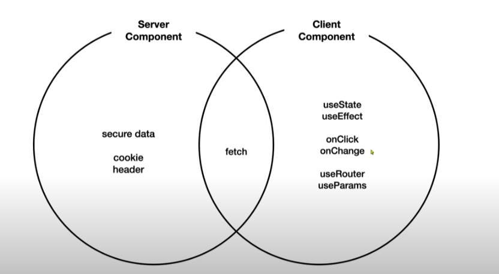

# Next.js 13
- [생활코딩 강의 참고](https://www.youtube.com/playlist?list=PLuHgQVnccGMCwxXsQuEoG-JJ7RlwtNdwJ)

## 시작하기
- 백엔드 `npx json-server --port 9999 --watch db.json`
- 프론트 `npm run dev`

## [ Full Stack Web Application Framework ]
1. SSR(Server Side Rendering)
2. App router
3. Server component 

## [ Single Page Application ]
- Link 태그 사용해서 페이지 이동, 마치 한 페이지처럼 동작
- 전체 페이지를 다시 로딩 하는 것이 아니라 바뀌는 부분만 로딩, 같은 페이지 클릭 해도 페이지 다시 불러오지 않음
- 사용자 입장에서는 빠르고 제공자 입장에서는 돈 절약

## [ [파일 구조](https://nextjs.org/docs/getting-started/project-structure): page, layout ]
### src/app/layout.tsx
- 기본적인 웹 페이지의 골격
```agsl
    <html>
      <body>{children}</body>
    </html>
``` 
- {children}은 src/app/page.tsx 에서 가져옴
- src/app/globals.css

## [ App 라우팅 ]
### 라우팅이란?
- 어떤 콘텐츠를 어떤 방식으로 보여줄 것인지 효율적인 경로를 결정
### 세그먼트(segment): App 하위에 디렉토리 생성
### 파일 규칙
- layout
    - 해당 페이지 공통 layout
    - layout이 없다면 상위 layout이 적용됨
    - layout이 있다면 해당 layout이 적용되고 상위 layout도 적용됨
- page
    - layout의 {children} 부분에 들어가는 콘텐츠
### 다이나믹 라우팅
- 디렉토리/[id]디렉토리 하위에 page 생성

## [ JSON Server 사용하기(백엔드) ]
- `npx json-server --port 9999 --watch db.json` 
  - 이 명령어를 입력하면 db.json 파일이 생성되고 로컬 9999번 포트에서 실행됨
- 브라우저에서 콘솔창에 아래의 코드를 입력하면 서버와 통신이 이루어지고 통신 결과가 화면에 출력되는 것을 확인할 수 있음
  ```
  fetch('http://localhost:9999/topics').then((resp) => {
    return resp.json();
  }).then(result => {
  console.log('result', result);
  });
  ```
- 참고: Next.js로 API 구축하는 방법: [Route Handlers](https://nextjs.org/docs/app/building-your-application/routing/route-handlers)

## [ Server Component & Client Component ]

- **Server Component**: 사용자와 상호작용하고 있지 않는다면 서버 컴포넌트 사용, 정보를 단순히 보여주는 역할
  - ex) Sidebar
- **Client Component**: 사용자와 상호작용하고 있다면 클라이언트 컴포넌트 사용
  - ex) button, useState

## [ [환경변수 설정](https://nextjs.org/docs/pages/building-your-application/configuring/environment-variables) ]
- .env.local 파일을 생성
### 서버 컴포넌트 환경변수 설정
- .env.local 파일에 `API_URL` 작성
  - ex) API_URL=http://localhost:9999/
  `process.env.API_URL`
### 클라이언트 컴포넌트 환경변수 설정
- 데이터가 웹브라우저로 전송되는 클라이언트 컴포넌트는 보안 상 서버 컴포넌트와 다른 방식
- .env.local 파일에 `NEXT_PUBLIC_API_URL` 작성
  - ex) NEXT_PUBLIC_API_URL=http://localhost:9999/
### 환경변수 작성
- `process.env.NEXT_PUBLIC_API_URL`

## [ 배포 ]
- 개발자용 배포판 명령이 따로 있는 이유
  - 크롬 개발자도구-네트워크 에서 새로고침을 해보면 하단에 6.3MB resources 라고 나옴(서버에서 클라이언트로 전송한 용량이 6.3MB나 된다는 것을 의미)
    - 큰 용량은 비효율적이고 보안에 문제가 될 수 있음
    - 배포판으로 실행하면 용량이 크게 줄어들 것임

- Node js 기반으로 만들어진 프로젝트들은 package.json 파일에서 "script" 안에 프로젝트를 유지보수하기 위한 명령어들이 있음
  - "build" 는 실서버를 위한 배포판을 만드는 명령. "start" 는 배포판을 서비스하기 위한 명령.
    - `npm run build` 입력 후 `npm run start`
    
